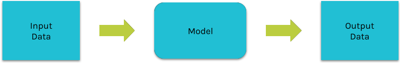
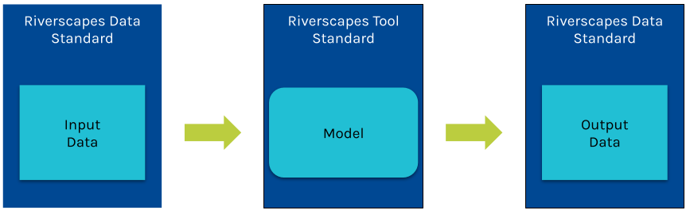
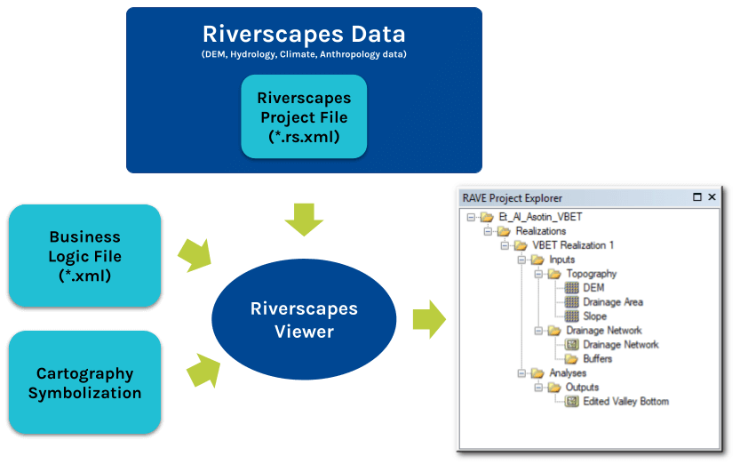

> The Riverscapes Consortium (RC) data standards is a simple flexible way of describing any data so that it can be stored in the Riverscapes Data Exchange and also be visualized with relevant, consistent cartography.

We have intentionally kept our standard minimal. We have designed it to be just enough to catalog each dataset and how it should be displayed in our RiverscapesViewers. 

## Core Concepts

Most geospatial and simulation modeling is built around the concept of transforming input data, and using some kind of model or transformer into output data. Each time the model is run can be considered a realization of some modelled state.

The Riverscapes Consortium have defined two standards; one for the data and one fo the model itself.

The data standard lists the data in question including mandatory and optional metadata. We refer to one set of input data as a “project”, regardless of whether it is an input or output dataset. In practical terms, the data is a plain text XML file. The standard itself is defined as a set of rules that must be followed for the XML file to be considered compliant with the standard. This ruleset is stored and published online in an XSD file. It specifies which XML tags should be used, how they should be used, and what attributes are required. Practical examples are provided for existing datasets for those wishing to learn how the standard can be applied to their own data.

## XML Rules

The XML rules are simple and generic. They are intended to accommodate data formats that are common among river scientists, while remaining flexible about how you choose to organize your data to accommodate its geospatial or temporal dimensionality.

Each project possesses its own XML file and the name of the file is always project.rs.xml. This file is packaged and travels with the data so that our applications (Data Exchange, Viewer and Studio)know about the standard can discover, process and visualize the data in the dataset. The project.rs.xml really is the magic sauce of the riverscapes data standard. It makes all other parts of our approach function.

## Business Logic

Software that displays datasets to users, such as the Riverscapes Viewer, use another XML file called Business Logic to translate the project XML file into more practical ways for the users to interact with the data. The Business Logic XML file defines how to organize the datasets in the project into a hierarchical tree and how to symbolize the data in maps.

Essentially, the Business Logic XML takes the technical specification of the data in the project file and turns it into a more useful format for more effectively finding and visualizing the data.

There is one [Business Logic XSD ruleset](https://github.com/Riverscapes/RiverscapesXML/blob/master/RaveBusinessLogic/XSD/project_explorer.xsd)  that specifies which tags can be used and how to combine them to define the hierarchical tree structure for each project type. Each model has its own business logic XML file.

Users can also customize the Business Logic for a particular model should they wish to visualize a project in different ways.

## Why Data Standards Are Important

### Increases Interoperability

The simple act of standardizing data on open source formats eliminates the need for expensive proprietary software that excludes those without the necessary license. Moreover, the standards allow for automated approaches to data processing that dramatically increase the scale at which analysis can be performed. The project.rs.xml makes it possible for any tool to read and load any file structure and use the data. Its with this approach that the Riverscapes Consortium has developed approximately six models that combine to form a data processing waterfall, each model handing off its outputs to the next step in the process. None of this would be possible without the riverscapes data standards.

### Faster Map Visualization

Simply dragging geospatial layers onto a map in GIS and accepting the default symbology limits the value we are gleaming from our data. We have solved this problem by incorporating a system of consistent cartographic symbology. This allows a model developer to design symbology once and have it reused across all our applications, regardless of whether its on the web, QGIS or ArcGIS. 

Every time you look at a certain layer it should look the same way. Not only does this avoid the repetitive, time consuming task of symbollizing data all the time, but it speeds comprehension because the presentation of the data is fit for purpose. Relevant colors are used. Categorical symbols and color ramps  fit the data. You no longer have to think about any of this once the data standard are applied.

## Increases Adoption

Riverscapes research, like many disciplines, is held back by too many technology silos and standalone ecosystems. The riverscapes emphasis on FAIR principles, a core tenant of which is open source non-proprietary data formats, is motivated by making data and software more accessible. The quicker and easier that people can get hold of data, the quicker they can incorporate it into their decision making. We are committed to reduce the  friction surrounding data and believe that more people will use your models and data if it complies with widely adopted standards.

# How to Apply Riverscapes Standards to Your Data

Follow these steps, all of which are underpinned by the [FAIR principles](https://www.go-fair.org/fair-principles/),  to apply the riverscapes standards to your data. 

1. Ensure that all the data are in open, non-proprietary formats. This is especially important for geospatial data. We recommend GeoTiffs for rasters and [GeoPackages](https://www.geopackage.org/) for vector data. ShapeFiles, although a published format are discouraged for [numerous reasons](http://switchfromshapefile.org/).

2. Organize the data into a logical file and folder structure. Use common sense and think about how users will consume the data. There are no specific rules about the folder structure.

3. Provide an accompanying XML file called project.rs.xml at the root of the folder structure. This XML file has a strict, but helpful structure that helps catalog the individual data files. This XML file must refer to the latest version of the [Riverscapes Data Standards published online](https://github.com/Riverscapes/RiverscapesXML/blob/master/Projects/XSD/V2/RiverscapesProject.xsd). The best way to ensure compliance is to refer to the XSD file and then validate your XML file using a tool such as Visual Studio Code. Data with a project.rs.xml file that does not validate cannot be incorporated into the Riverscapes Data Exchange.

4. Ensure that the project.rs.xml file includes appropriate metadata to help others understand and leverage your data. No one likes metadata, but this is your chance to help future you remember all the nitty gritty details about where the data originated, how it was processed and any limitations on its use.

